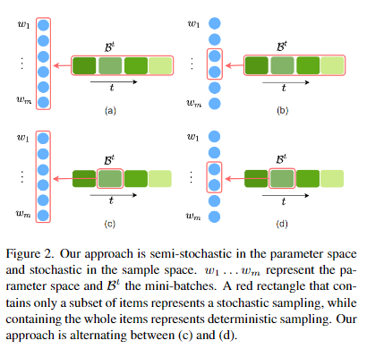

# LayerDropBack: Accelerating Deep Network Training

## Description
LayerDropBack (LDB) introduces a novel approach to accelerate deep neural network training by selectively dropping layers during the backward pass, while maintaining the integrity of the forward pass. This technique allows the network architecture used during training to remain unchanged during inference, thus facilitating straightforward model deployment. The method has been validated across multiple architectures and datasets, including ViT, SwinTransformer, and EfficientNet on CIFAR-100 and ImageNet, demonstrating significant reductions in training times without sacrificing accuracy.



## Installation

```bash
git clone https://github.com/neiterman21/LDB.git
cd LDB
pip install -r requirements.txt
```
## Example
Here is an example script showing how to train a ResNet50 model using LayerDropBack on the CIFAR-100 dataset.

```
python main.py --model resnet50 --dataset cifar100
```

## Results
Using LayerDropBack, we achieve an average speedup of 23.3% in model training from scratch and 16.93% in fine-tuning, with minimal impact on model accuracy. For more detailed performance metrics, see the results/ directory.

## Citation
If you find this project useful for your research, please use the following BibTeX entry.

        @inproceedings{layerdropback2025,
          title={LayerDropBack: Accelerating Deep Network Training by Forward-Consistent Stochastic Regularization},
          author={},
          booktitle={},
          year={}
        }

